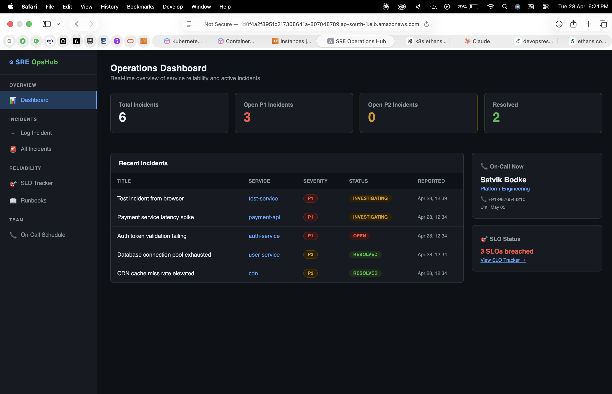
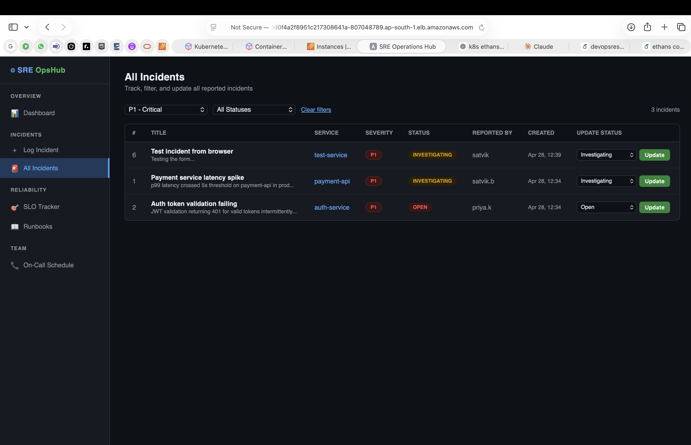
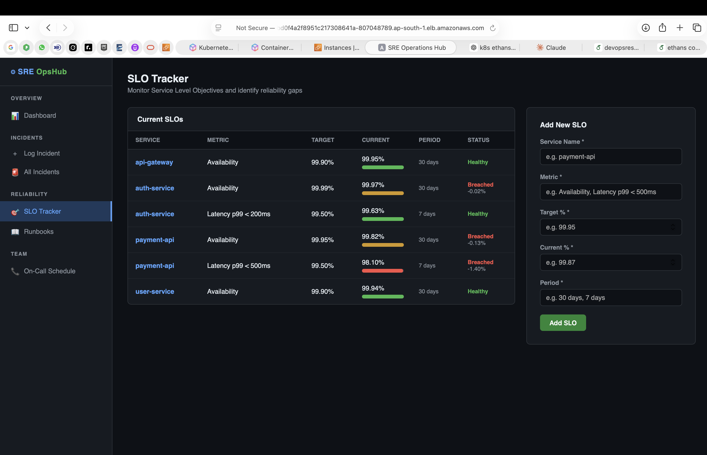
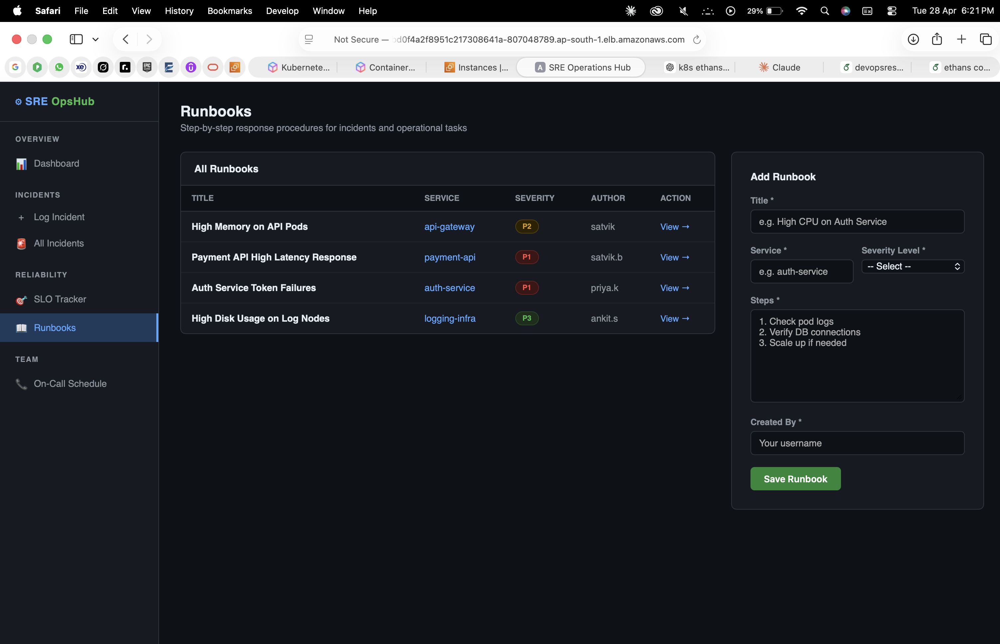
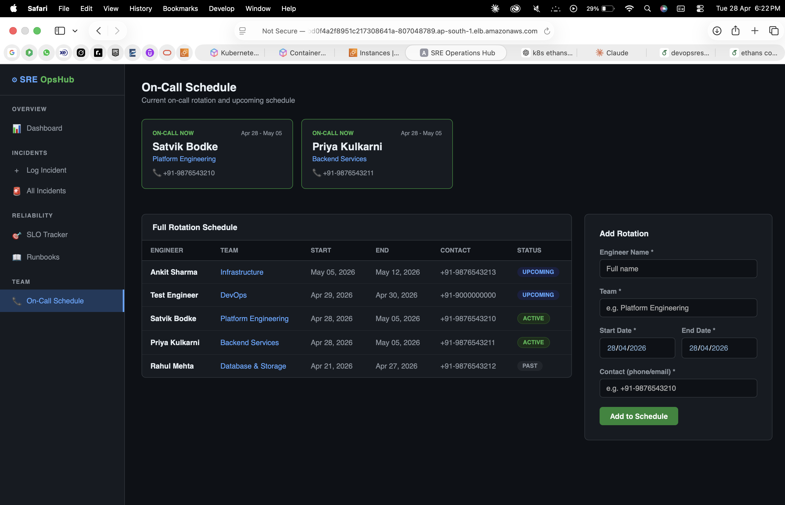

# SRE Operations Hub

A containerized Site Reliability Engineering operations platform deployed on **AWS EKS (Kubernetes)**. Built for DevOps/SRE teams to centrally manage incidents, track SLOs, store runbooks, and maintain on-call schedules.

## Architecture

```
  Developer Machine
  ┌─────────────────────────────┐
  │  Docker Build               │
  │  docker compose build       │
  │  ┌──────────┐ ┌──────────┐  │
  │  │ pro1-app │ │pro1-mysql│  │
  │  └────┬─────┘ └────┬─────┘  │
  └───────┼─────────────┼────────┘
          │  docker push│
          ▼             ▼
  ┌───────────────────────────────┐
  │         AWS ECR               │
  │  ┌──────────┐  ┌──────────┐  │
  │  │  app:v2  │  │  db:v2   │  │
  │  └──────────┘  └──────────┘  │
  └───────────────┬───────────────┘
                  │ kubectl apply
                  ▼
  ┌───────────────────────────────────────────────┐
  │               AWS EKS Cluster                  │
  │                                                │
  │   ┌────────────────────────────────────────┐  │
  │   │         Kubernetes Namespace            │  │
  │   │                                        │  │
  │   │  ┌──────────┐ ┌──────────┐ ┌────────┐ │  │
  │   │  │ php-app  │ │ php-app  │ │php-app │ │  │
  │   │  │  pod 1   │ │  pod 2   │ │ pod 3  │ │  │
  │   │  └────┬─────┘ └────┬─────┘ └───┬────┘ │  │
  │   │       └────────────┼───────────┘      │  │
  │   │              ┌─────▼──────┐           │  │
  │   │              │ mysql pod  │           │  │
  │   │              │ ClusterIP  │           │  │
  │   │              └────────────┘           │  │
  │   └──────────────────┬─────────────────────┘  │
  │                      │ LoadBalancer Service    │
  └──────────────────────┼────────────────────────┘
                         ▼
              ┌─────────────────────┐
              │   AWS Load Balancer  │
              │   (ALB - port 80)   │
              └──────────┬──────────┘
                         ▼
                      Browser
```

## Tech Stack

- **App:** PHP 8.0 + Apache
- **Database:** MySQL 8.0
- **Containerization:** Docker + Docker Compose
- **Registry:** AWS ECR (Private)
- **Orchestration:** Kubernetes on AWS EKS
- **Load Balancer:** AWS ALB (auto-provisioned via K8s LoadBalancer service)
- **Replicas:** 3x PHP app pods + 1x MySQL pod

## Features

| Module | Description |
|--------|-------------|
| Dashboard | Real-time overview — open P1s, SLO breaches, on-call engineer |
| Incident Tracker | Log P1/P2/P3 incidents, update status, filter by severity |
| SLO Tracker | Add and monitor Service Level Objectives with breach detection |
| Runbooks | Store step-by-step operational response procedures |
| On-Call Schedule | Manage team rotation with active/upcoming/past status |

## Screenshots

### Dashboard


### Incident Tracker


### SLO Tracker


### Runbooks


### On-Call Schedule


## Run Locally (Docker)

> No AWS account needed — runs fully on your machine.

**Prerequisites:** Docker + Docker Compose installed

```bash
# 1. Clone the repo
git clone https://github.com/YOUR_USERNAME/sre-operations-hub.git
cd sre-operations-hub/Docker

# 2. Build and start containers
docker compose up --build

# 3. Open in browser
http://localhost
```

To stop:
```bash
docker compose down
```

## Deploy on AWS EKS

### Prerequisites
- AWS account with EKS cluster running
- kubectl configured (`aws eks update-kubeconfig --region <region> --name <cluster>`)
- Images pushed to ECR

### Step 1 — Push images to ECR
```bash
# Login to ECR
aws ecr get-login-password --region ap-south-1 | docker login --username AWS --password-stdin <account_id>.dkr.ecr.ap-south-1.amazonaws.com

# Build
cd Docker
docker compose build

# Tag and push app image
docker tag pro1-app:latest <account_id>.dkr.ecr.ap-south-1.amazonaws.com/app:v2
docker push <account_id>.dkr.ecr.ap-south-1.amazonaws.com/app:v2

# Tag and push db image
docker tag pro1-mysql:latest <account_id>.dkr.ecr.ap-south-1.amazonaws.com/db:v2
docker push <account_id>.dkr.ecr.ap-south-1.amazonaws.com/db:v2
```

### Step 2 — Update Kubernetes YAMLs
Edit `Kubernetes/mysql-deployment.yaml` and `Kubernetes/php-app-deployment.yaml` — replace the `image:` field with your ECR image URLs.

### Step 3 — Apply to cluster
```bash
cd Kubernetes
kubectl apply -f mysql-deployment.yaml
kubectl apply -f mysql-service.yaml
kubectl apply -f php-app-deployment.yaml
kubectl apply -f php-app-service.yaml
```

### Step 4 — Get the URL
```bash
kubectl get svc php-app-service
# Copy the EXTERNAL-IP and open in browser
```

## Project Structure

```
sre-operations-hub/
├── Docker/
│   ├── docker-compose.yml
│   ├── app/
│   │   ├── Dockerfile
│   │   ├── index.php          # Dashboard
│   │   ├── log_incident.php   # Log new incident
│   │   ├── view_incidents.php # View & update incidents
│   │   ├── manage_slo.php     # SLO tracker
│   │   ├── runbooks.php       # Runbook management
│   │   ├── oncall.php         # On-call schedule
│   │   ├── db.php             # DB connection
│   │   ├── header.php         # Shared nav layout
│   │   └── footer.php
│   └── mysql/
│       ├── Dockerfile
│       └── init.sql           # Schema + sample data
└── Kubernetes/
    ├── mysql-deployment.yaml
    ├── mysql-service.yaml
    ├── php-app-deployment.yaml
    └── php-app-service.yaml
```
